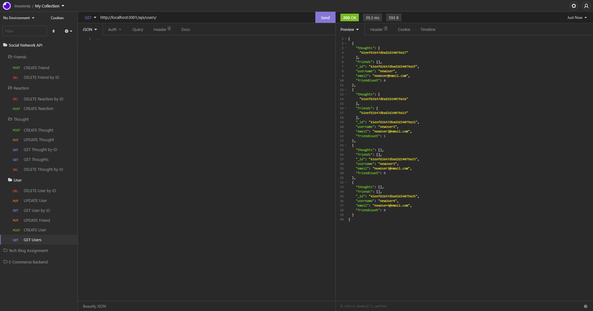
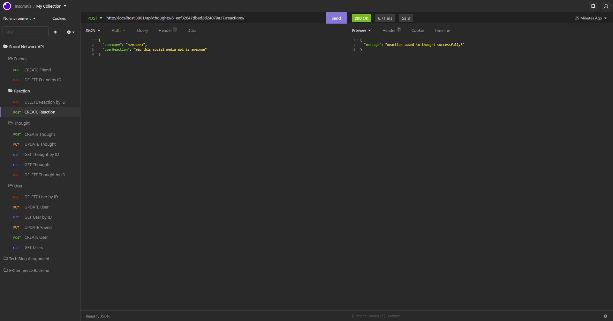

# Social Network API 

## Brief Description 🔖 
   A Social Network API using MongoDB.

## Table of Contents 📇
   * [Brief Description](#description)
   * [About Social Network API](#about)
   * [Installation](#install)
   * [Usage](#usage)
   * [Testing](#test)
   * [Screenshots](#screenshots)
   * [Demo Video](#demo)
   * [Github Pages URL](#pages) 
   * [Github Repository URL](#repo)
   * [Contact Details](#contact)
   * [License](#license)
   * [Contributions to Repo](#contributions)
   * [Additional Information](#info)

## About Social Network API 📖 
   A Social Network API using MongoDB.  Have the ability to add friends, thoughts, and reactions.  All features required in your typical Social Network back-end.  All this API needs is just a front-end to be operational.
   
## Installation 🏗️ 
   npm i
 
## Usage 📝 
   npm start

## Testing 
   npm test

## Screenshots 📷 
   
    
   
    
## Demo Video 📺 
   <a href="https://youtu.be/ahYnrC67w_w" target="_blank">----==== YouTube.com Video Link (with audio) ====----</a>
    
    

   
        
## Github Pages URL 🔗 
   <a href="https://bkturner1220.github.io/Social_Network_API" target="_blank">https://bkturner1220.github.io/Social_Network_API</a>
   
## Github Repository URL 🔗 
   <a href="https://github.com/bkturner1220/Social_Network_API" target="_blank">https://github.com/bkturner1220/Social_Network_API</a>
     
## Contact Information 
   Github Username: [bkturner1220](https://github.com/bkturner1220/) 
   Github: <a href="https://github.com/bkturner1220/">https://github.com/bkturner1220/</a> 
   Email: <a href="mailto:bturner@texascdlprep.com">bturner@texascdlprep.com</a>
   
## License Information 📛 
 
   The application is covered under MIT license.
   
## Contributions towards Social Network API 👫 
   SMU Coding Bootcamp and lots of random documentation
         
## Additional Information 
   If you encounter any problems, please feel free to reach out to me by sending me a [Email] to <a href="mailto:bturner@texascdlprep.com">bturner@texascdlprep.com</a>.
